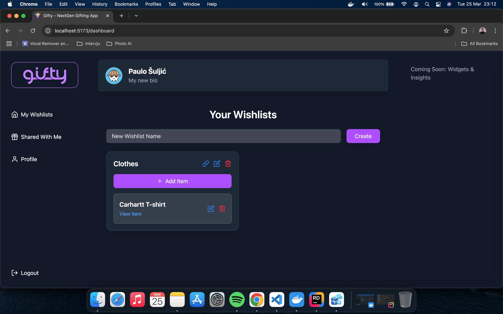

# 🎁 Gifty Frontend

> A modern, responsive wishlist sharing app built with **React**, **Firebase**, and **Tailwind CSS**.  
> Create wishlists, share them with friends, and reserve gifts seamlessly — even for guests.

---

## 🌐 Live Demo

👉 [https://nice-field-033302003.6.azurestaticapps.net](https://nice-field-033302003.6.azurestaticapps.net)

---

## 📸 Screenshots

<p align="center">
  
  <br/>
  
</p>

---

## ⚙️ Tech Stack

- ⚛️ **React + Vite + TypeScript**
- 💅 **Tailwind CSS**
- 🔐 **Firebase Auth** (Email/Password + Google)
- 📦 **Custom REST API** (via ASP.NET backend)
- 🌐 **Azure Static Web Apps** (CI/CD deployment)

---

## ✨ Features

- 🔐 Authentication with email verification & Google login
- 🧾 Wishlist creation, editing, deletion
- 🔗 Shareable wishlist links (guests can view & users can view + reserve)
- ✅ Reservation logic (1 item per wishlist per user)
- 👤 Editable profile with bio and avatar
- 📱 Fully responsive mobile-first UI
- 🍞 Toast notifications for feedback
- 🧭 Route protection with smooth loading animations

---

## 📁 Folder Structure
```
src/
├── components/        # Reusable components (Sidebar, Layout)
├── pages/             # Login, Register, Profile, SharedWishlist
├── firebase/          # Firebase config
```

---

## 🧪 Development

```
git clone https://github.com/paulo-suljic/gifty-frontend
cd gifty-frontend
npm install
npm run dev
```

Create a .env file:

```
VITE_FIREBASE_API_KEY=...
VITE_FIREBASE_AUTH_DOMAIN=...
VITE_API_BASE_URL=https://gifty-api.azurewebsites.net
```

---

## 🚀 Build for Production
```
npm run build
```

---

## 🛡 Security
- Auth state is validated using Firebase ID tokens
- Protected routes using PrivateRoute
- Email must be verified before access

---

## 🤝 Contributing
Open to PRs, ideas, and feedback — just fork and submit a pull request!
